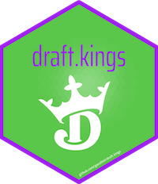

<!-- README.md is generated from README.Rmd. Please edit that file -->

```{r, include = FALSE}
knitr::opts_chunk$set(
  collapse = TRUE,
  comment = "#>",
  fig.path = "man/figures/README-",
  out.width = "100%"
)
```

# draft.kings <a href="github.com/gacolitti/draft.kings"></a>


<!-- badges: start -->
[](https://github.com/gaclitti/draft.kings)
[](https://github.com/gacolitti/draft.kings/actions/workflows/R-CMD-check.yaml)
[](https://app.codecov.io/gh/gacolitti/draft.kings)
<!-- badges: end -->

# Overview

`draft.kings` is an R package that wraps the undocumented DraftKings API, providing seamless access to data and additional tools for fantasy sports strategy. 

Key features:

- Retrieve contests and draftable players
- List participants and scores
- Optimize lineups

`draft.kings` aims to be the most comprehensive API wrapper package for DraftKings in any programming language. Users are encouraged to create issues for new endpoints or bugs to help improve the package.

### Installation

You can install the development version of draft.kings from [GitHub](https://github.com/) with:

``` r
# install.packages("devtools")
devtools::install_github("gacolitti/draft.kings")
```

```{r, echo = FALSE}
library(draft.kings)
```

# Examples

## Contests & Draft Groups

**Contest Info**
```{r}
contest_info <- dk_get_contest_info(contest_key = 133645678) 

contest_info$contest_summary

contest_info |> 
  dplyr::select(contest_key, contest_summary, payout_description, sport, entry_fee, entries)

```

**Draft Group**
```{r}
draft_group <- dk_get_draft_group(draft_group_id = 75284)

draft_group |> 
  dplyr::select(draftable_id, player_id, first_name, last_name, position, salary, status)
```

**Draft Group Info**
```{r}
dg_info <- dk_get_draft_group_info(draft_group_id = 75284)

dg_info$info |> 
  dplyr::select(draft_group_id, game_type_id, sport, game_type, min_start_time, max_start_time)

dg_info$games |> 
  dplyr::select(game_id, away_team_id, home_team_id, start_date, location, time_remaining_status)

dg_info$leagues |> 
  dplyr::select(league_id, league_name, league_abbreviation)
```

## Leaderboard & Entries

**Leaderboard**
```{r}
leaderboard <- dk_get_leaderboard(contest_key = 133645678)

leaderboard |> 
  dplyr::select(draft_group_id, contest_key, entry_key, user_name, rank, fantasy_points)
```

**Entries**
```{r}
entries <- dk_get_entries(draft_group_id = 80584, entry_keys = c(3618408508, 3618897002))

entries |> 
  dplyr::select(entry_key, draftable_id, display_name, roster_position, fantasy_points)
```

## Lineup Optimization

**Prepare Schematic**
```{r}
# prepare schematic with contest rules and DraftKings player projections
schematic <- dk_prepare_schematic(draft_group_id = 80584)
schematic |> names()
```

**Run Optimization**
```{r}
# perform lineup optimization based on rules and player projections 
optimized_lineup <- dk_optimize_lineup(schematic)
```

**Extract Solution**
```{r}
# extract solution from optimized lineup object
solution <- dk_extract_solution(optimized_lineup)

solution |> names()

# exp_fp is the expected fantasy points for each player in the lineup
solution$optimal_lineup |> 
  dplyr::select(draftable_id, display_name, position, salary, exp_fp)

# total expected fantasy points for the lineup
solution$exp_fp_total
```

# Further Reading

- [SeanDrum/Draft-Kings-API-Documentation](https://github.com/SeanDrum/Draft-Kings-API-Documentation)
